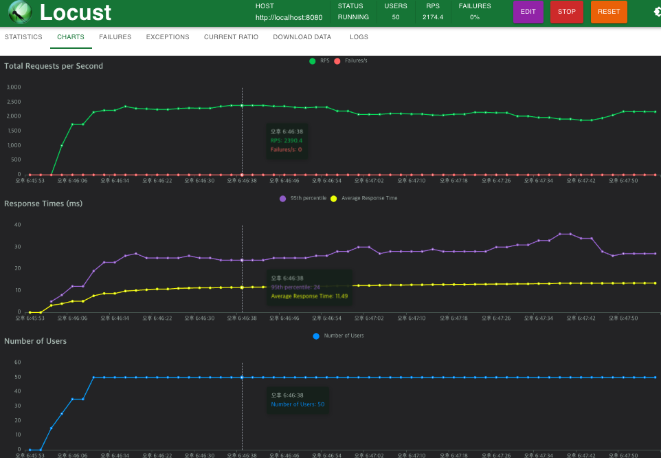
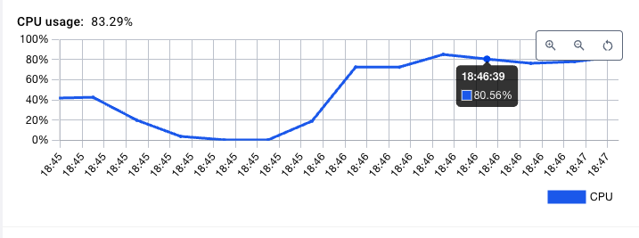
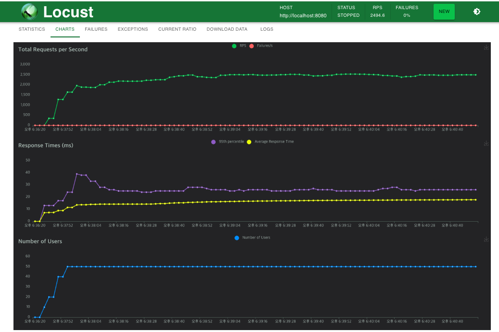
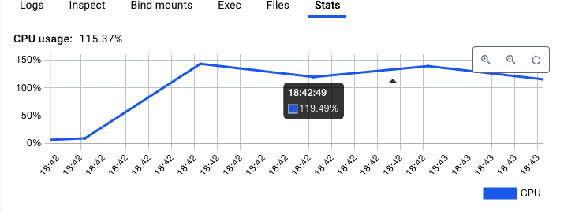
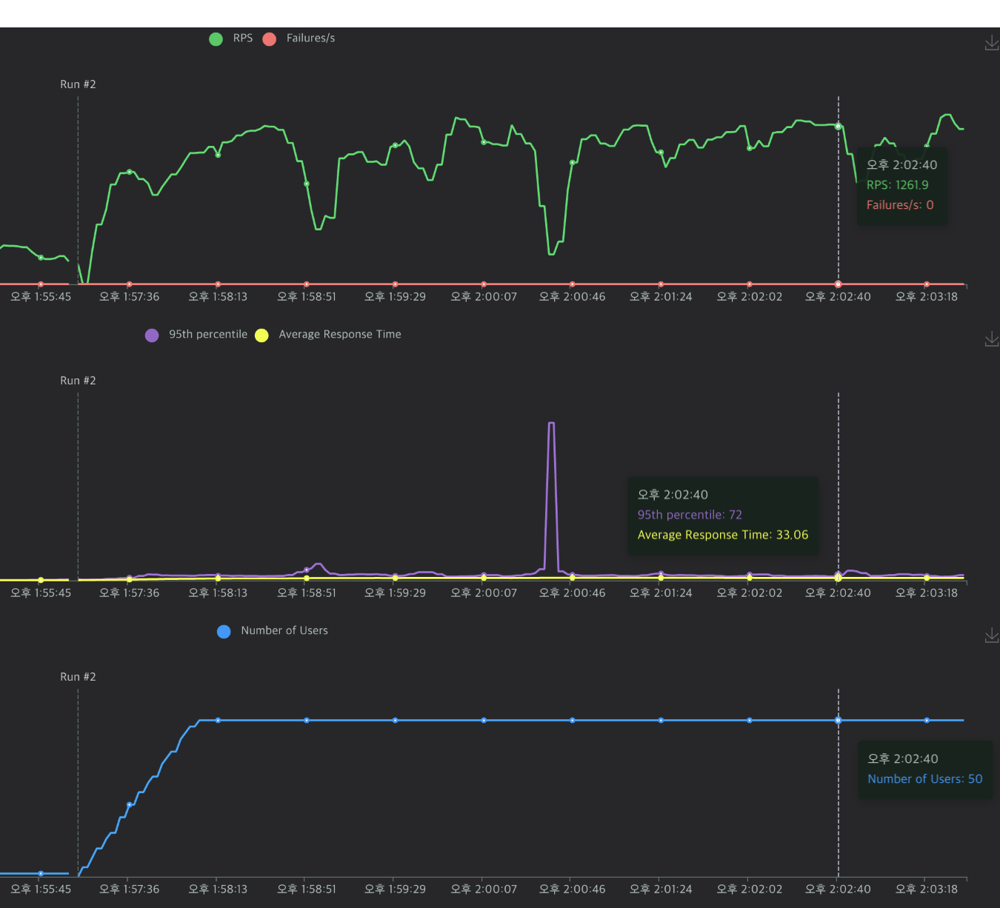
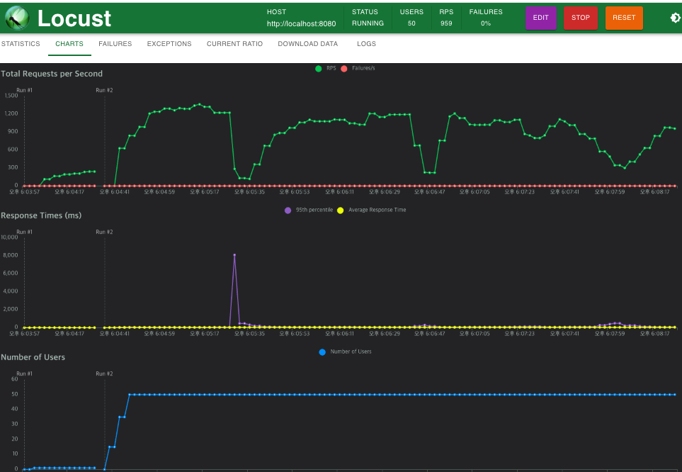

# 리소스의 소유자를 느슨하게 설계하기. (+ 성능상 하자가 있는지 확인하기)  


## 개요 

이번 프로젝트 개발중에, 리소스 오너(글쓴이, 댓글쓴이, 리액션쓴이) 에 대한 관리를 어떻게 할지에 대한 고민입니다.

기획의 방향이 아래처럼 바뀐다고 가정해 봅시다.

### [AS-IS]
- 로그인한 유저만 글쓰기, 댓글, 리액션이 가능 
  - 따라서 특정 리소스의 소유자는 유저 아이디로 충분하다.

### [TO-BE]
-  로그인을 하지 않아도 "댓글", "리액션", "특정 게시글" 은 작성이 가능하게 하고 싶다.
  - 따라서 리소스 오너는 ipv4, 유저 아이디 둘 다 될 수 있다.


### [TO-TO-BE]
- 이젠 어떤 것을 기준을 리소스 오너를 결정할 수 있을지 모른다.
  - 단체가 리소스의 주인이 될 수도 있다.! 가령 A 게시글은 L사 임직원은 모두 바꿀 수 있다 라던가 ..


</br>


## 결론부터..

아래에 locust 측정 자료와 쿼리를 확인할 수 있습니다 . 

- 성능상 드라마틱한 차이는 없다.
  - 조회 기준, 50 명의 동시 접속유저에 대한 throuput dms 2000RPS 정도로 동일하나, cpu usage 에서 80% <-> 110%  정도의 30 프로정도 차이가 발생했다.
- 그냥 jpa 기본 함수 사용 시, jpa 기본 함수를 쓴다면 n+1 문제가 발생한다.
  - jpql, graph entity 등을 사용을 권장한다.


우리 서비스에서는 아마 그냥 cpu 사용량에 대한 부담은 어느정도 감수하고 사용하지 않을까 싶다.

서비스로의 쓰기, 리스팅 요청이 초당 1000건 이상 오지도 않을 것이고, 무엇보다 컴퓨팅 파워에 대한 부담은 캐싱을 잘해서 줄이는게 좋지 않을까 라는 생각...


### 느슨한 소유자 관계 갖기

투투비까지는 생각 않더라도 "디씨인싸이드", "레딧" 등의 게시판을 보면 ipv4 를 기준으로 글, 댓글을 작성, 수정할 수 있는 기능은 많다.

이런 구현의 유연함을 가지도록 개발하는 것이 목표이다. 


</br>

기존에 "유저"를 글쓴이로만 치는 경우는 아래같은 경우로 가능합니다.


```java
class SomeResource{
    @Id
    Long id;
    
    Long authorId; // AS-IS 에서의 로그인 유저만 리소스 소유자가 되는 경우. 
    ....
}
```


아래는 ipv4 주소, AuthorId 를 둘 다 가질 수 있는 구조입니다.
(연관관계로 가지고 있는 경우)


```java
class SomeResource{
    @Id
    Long id;
    
    ResourceOwner resourceOwner; // To-BE 리소스 소유자를 추상화 한 경우.
    ....
}

class ResourceOwner{
    @Id
    Long id;
    
    @Enumerated(EnumType.String)
    OwnerType ownerType;
    
    String ipv4;
    
    String userId;
}

```

이렇게  " 바꿀 수는 " 있다.

아래의 측정 결과는 과연 이렇게 바꿔도 괜찮은가 (성능상으로 , jpa 적인 관점으로 ) 에 관한 글이다. 
 

## 대략적인 장점.

```java
class SomeResource{
    @Id
    Long id;
    
    @OneToOne(cascade = CascadeType.ALL)
    @JoinColumn(name = "resource_owner_id")
    ResourceOwner resourceOwner;
    ....
}

class ResourceOwner{
    @Id
    Long id;
    
    @Enumerated(EnumType.String)
    OwnerType ownerType;
    
    String ipv4;
    
    String userId;
}

```

이렇게 바꿨을 때의 대략적인 장점은 아래와 같다.

- 접근 권한 / 리소스 오너에 대한 기획의 변경에 원 테이블이 영향을 받지 않는다.  따라서 ResourceOwner 를 독자적으로 발전 시킬 수 있다.
- mapped super class 를 잘 사용한다면 접근 권한에 대한 내용도 자바로직상에서 공통으로 관리가 되니, 그렇게 공수가 많이 드는 것도 아니다.


## 테스트 목적 

위의 설계에 대해 의문인 점을 해결하려 자료를 남김

의문인점은
- 성능상으로 괜찮은가?
  - 단건 조회에도 join 이 걸림
  - 한건 save 시, 3번의 쿼리 수행 ( save, save update -> 외래키에 대한 update )
  - n+1 문제가 발생? 


이런 문제를 직접 이제 돌려보고, locust 를 찍어보면서 성능상 큰 하자가 있는지 확인해 보는 자료입니다.


# 지표 보기 .

locust 를 이용해서, 최대 throuput, cpu 부하 를 측정한다.

제약사항은 아래와 같다.

- cpu: 2 core ( docker)
- 유저 : 50 명
- hikaricp dead lock 때문에 db 커넥션은 넉넉히 200개. 

# 읽기 비교 .

## AS-IS 읽기 
```sql
Hibernate: 
    select
        awui1_0.id,
        awui1_0.content,
        awui1_0.title,
        awui1_0.user_id 
    from
        article_with_user_id awui1_0 
    where
        awui1_0.user_id=?

```

### AS-IS 읽기  -퍼포먼스 : 2300 RPS 



###  AS-IS 읽기 - cpu : 80%




## TO-BE 읽기 

### 쿼리
```sql
Hibernate: 
    select
        awro1_0.id,
        awro1_0.content,
        ro1_0.resource_owner_id,
        ro1_0.ipv4,
        ro1_0.owner_type,
        ro1_0.user_id,
        awro1_0.title 
    from
        article_with_resource_owner awro1_0 
    join
        resource_owner ro1_0 
            on ro1_0.resource_owner_id=awro1_0.resource_owner_id 
    where
        ro1_0.ipv4=?
```

### TO-BE 읽기 퍼포먼스 : 2300 qps 



### TO-BE 읽기 cpu : 120%




</br>


# 쓰기 비교 

## AS-IS 쓰기 

```sql
Hibernate: 
    insert 
    into
        article_with_user_id
        (content, title, user_id, id) 
    values
        (?, ?, ?, ?)
```


### 쓰기 1200 RPS 




## TO-BE 쓰기 

```sql
Hibernate: 
    insert 
    into
        resource_owner
        (ipv4, owner_type, user_id, resource_owner_id) 
    values
        (?, ?, ?, ?)
Hibernate: 
    insert 
    into
        article_with_resource_owner
        (content, resource_owner_id, title, id) 
    values
        (?, ?, ?, ?)

```

### 성능 : 1200RPS 

